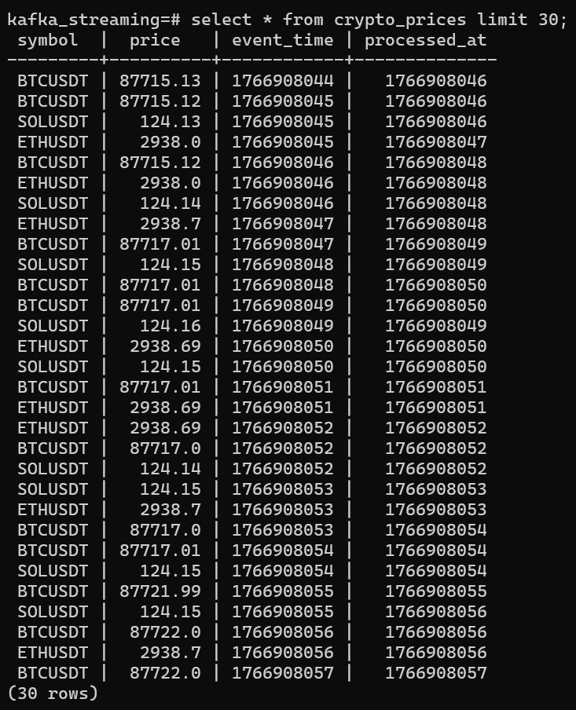

# 🟦 README — `crypto-streaming-pipeline`

# Crypto Streaming Pipeline (Kafka)

## Overview

This project implements a **real-time, multi-asset crypto price streaming pipeline**
using **Apache Kafka** and a **relational database sink**.

Live trade price events are ingested from Binance WebSocket, validated against a
strict schema, published to Kafka, consumed reliably, and persisted into PostgreSQL
using an **idempotent sink design**.

The primary goal of this project is to demonstrate **event-driven data ingestion,
delivery guarantees, and failure-safe persistence**, rather than visualization or analytics.

---

## Architecture

```
Binance WebSocket
↓
Kafka Producer
↓
Kafka Topic (crypto_prices)
↓
Kafka Consumer
↓
PostgreSQL (idempotent sink)
```

---

## Data Source

- **Source**: Binance WebSocket API  
- **Endpoint**:  
```

wss://stream.binance.com:9443/ws/{symbol}@trade

````

**Assets streamed**:
- BTCUSDT
- ETHUSDT
- SOLUSDT

**Event type**:
- Trade price events

Each incoming WebSocket message represents a single trade event emitted by the exchange.

---

## Event Schema

Each event is validated before being sent to Kafka using **Pydantic**.

### Event Fields

| Field          | Type    | Description                                  |
|---------------|---------|----------------------------------------------|
| symbol        | string  | Asset symbol (BTCUSDT, ETHUSDT, SOLUSDT)     |
| price         | float   | Trade price                                  |
| event_time    | int     | Event timestamp from source (epoch seconds) |
| processed_at  | int     | Ingestion timestamp (epoch seconds)          |

Schema validation acts as the **first data quality gate**, ensuring that only well-formed
events are published to Kafka.

---

## Kafka Design

- **Kafka distribution**: Confluent Kafka
- **Mode**: KRaft (ZooKeeper-less)
- **Topic**: `crypto_prices`
- **Partitioning key**: `symbol`

### Producer Configuration

- `acks=all`
- `enable.idempotence=true`
- Retry enabled with batching

---

## Delivery Semantics

This pipeline follows **at-least-once delivery semantics**.

### Reliability Strategy

- Kafka offsets are committed **only after** a successful database transaction
- Duplicate events are handled at the sink layer using database constraints

This design ensures **no data loss**, even if consumers crash or restart.

---

## Database Design

### Table Schema

```sql
CREATE TABLE IF NOT EXISTS crypto_prices (
  symbol TEXT NOT NULL,
  price NUMERIC NOT NULL,
  event_time BIGINT NOT NULL,
  processed_at BIGINT NOT NULL,
  PRIMARY KEY (symbol, event_time)
);
````
---

## Failure Handling

### Consumer Failure

If the consumer crashes before committing offsets:

* Kafka retains the uncommitted messages
* On restart, messages are reprocessed
* Duplicate inserts are prevented by the database primary key

### Database Failure

If PostgreSQL becomes unavailable:

* Insert operations fail
* Kafka offsets are **not committed**
* Once the database recovers, messages are reprocessed safely

---

Pipeline behavior is controlled via `config/settings.yaml`, including:

* Kafka bootstrap servers
* Kafka topic name
* List of asset symbols

This allows the pipeline to scale to additional assets **without code changes**.

---

## Tech Stack

* Apache Kafka (Confluent, KRaft mode)
* Python 3.12
* Pydantic
* SQLAlchemy
* PostgreSQL
* Docker & Docker Compose
* Poetry
* WebSockets
* PyYAML

---

## How to Run

### 1. Start infrastructure

```bash
docker-compose up -d
```

### 2. Start the producer

```bash
poetry run python producer/producer_streaming.py
```

### 3. Start the consumer

```bash
poetry run python consumer/consumer.py
```

---

## Example Output



The table `crypto_prices` will be continuously populated with live trade data
from multiple assets.

---

## Design Decisions

* **Kafka** is used to decouple producers and consumers and provide durable event storage
* **At-least-once delivery** is chosen for simplicity and reliability
* **Idempotent sink design** avoids complex exactly-once coordination
* **PostgreSQL** is used as a lightweight, transactional sink suitable for streaming ingestion
* **Schema validation** is enforced at the producer to prevent invalid data from entering Kafka

---
